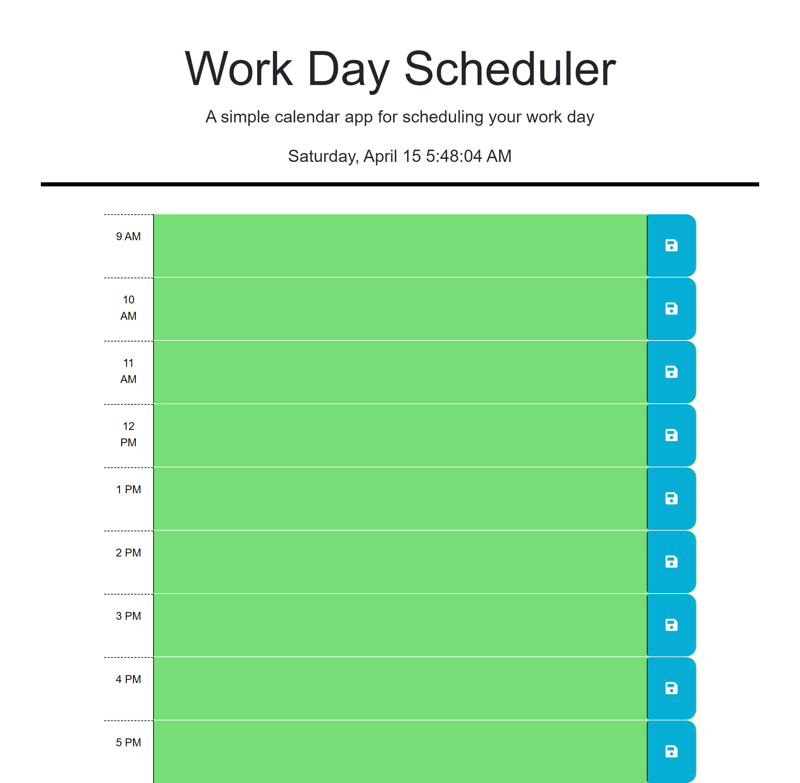

# Personal-Work-Day-Scheduler

## Description

In this project,

## Table of Contents (Optional)

N/A

## Installation

None required. Just access HTML, CSS, and JS files to examine the codes.

## Usage

1. Access the repository from https://github.com/Dinh282/timed-quiz.git. 
2. Clone repo to local machine.
3. Examine index.html file with VS Code using live server extensions. 
4. Click on the Start Quiz button to start the quiz.
5. Once done, you can enter your initial and see it displayed in the highscore page.
6. The local store can also be examine in the application tab of the inspect element tool in the chrom browser.

Alternatively:
1. Visit https://dinh282.github.io/timed-quiz/.
2. Start the quiz by clicking ont he quiz button. 
3. You can also use the inspect tool to examine the source code form the browser as well as the local storage to see what information is storage there.

Image of webpage:

## Credits

1. https://www.javatpoint.com/jquery-tutorial (Jquery and Jquery UI Docs)
6. My Instructor and TAs.

## License

Please refer to the LICENSE section in the repository.

---
